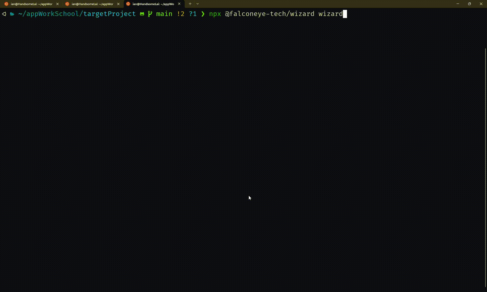

# FalconEye wizard



# Usage

### Running Wizard with npx

```javascript
npx @falconeye-tech/wizard wizard
```

# Options

```
Options:
  -V, --version             output the version number
  -h, --help                display help for command

Commands:
  wizard                    a wizard to help to configure all things step by step
  build [options] <string>  Build bundle source map files for the js file
  help [command]            display help for command
```
